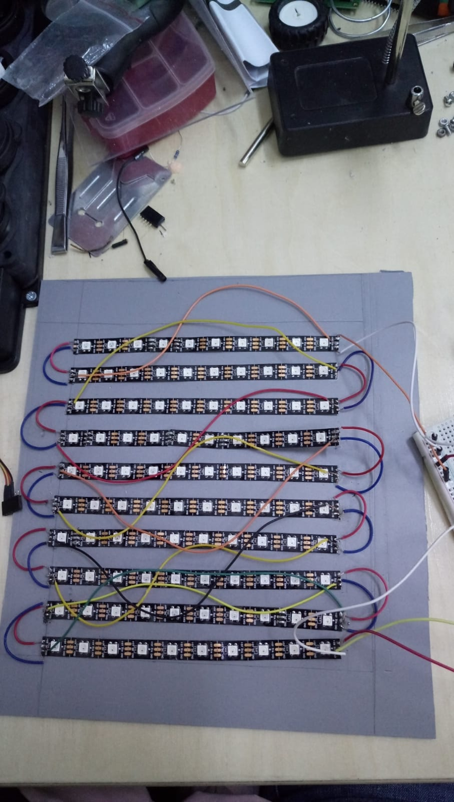
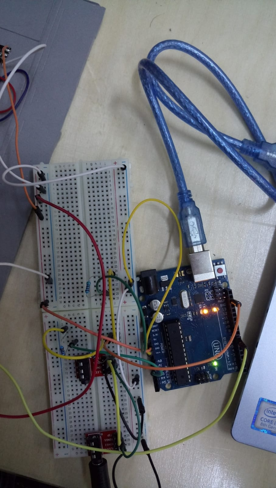

Spectrum Analyzer that analyzes the intensity of different frequencies in a song. The obtained values will be displayed on a 10x10 LED Matrix. 

Hardware components:
    - 10  ws2812B LED strips
    - wires
    - Arduino Uno
    - 2x100k resistors
    - 3x5k resistors
    - audio jack module
    - jack to jack cable
    - 2x104nF capacitor
    
     
     
    
